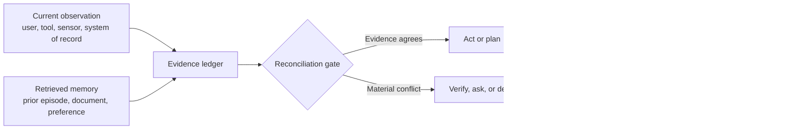

<p align="center">
  <h1 align="center">DSER</h1>
  <p align="center"><strong>Don’t let your agent confuse memory with truth.</strong></p>
  <p align="center">A provenance-aware control layer for agents that must reconcile what they just learned, what they remember, and what they can verify before they act.</p>
  <p align="center">
    <a href="https://github.com/EdgeAgent/dser-agent-framework"></a>
    
    <a href="LICENSE"></a>
    
  </p>
</p>

> Your agent remembers that a customer prefers **email**. The current account record says **SMS**. What happens next should not be a guess.

**DSER**—**Dual-Stream Evidence Reconciliation**—turns that collision into a deliberate decision. It keeps current observations and retrieved memory separate, preserves source metadata, detects material disagreement, and routes the agent to **act, plan, verify, ask, or defer**.

```text
Current evidence  +  Retrieved memory  +  Trusted verification  =  Auditable action
```

[Quick start](#start-in-60-seconds) · [Developer tutorial](docs/quickstart.md) · [API reference](docs/api-reference.md) · [See the conflict loop](#the-dser-loop) · [Read the design](docs/design.md) · [Run the example](examples/resolve_conflict.py)

---

## The problem DSER solves

Most agent stacks retrieve a few relevant memories, paste them into context, and hope the model chooses wisely. That is convenient until the memory is stale, semantically similar but wrong, weakly sourced, or in conflict with a system of record.

DSER gives agents a **memory safety belt**. Retrieved context remains useful, but it becomes evidence to evaluate—not an instruction to obey.

| Without DSER | With DSER |
| --- | --- |
| Retrieved text silently shapes the answer. | Every material claim keeps its source, time, support, and authority. |
| The agent sees conflict as more text to summarize. | The agent sees conflict as a control signal. |
| High model confidence can mask weak evidence. | Missing provenance remains a visible safety constraint. |
| Old outcomes are stored indiscriminately. | Only validated, useful, source-attributed outcomes become durable memory. |

## The moment that matters

Imagine a support agent preparing to change a customer’s delivery channel.

| Evidence stream | Claim | What DSER does with it |
| --- | --- | --- |
| Retrieved episode | “The customer prefers email.” Recorded 90 days ago. | Keeps it as context, but discounts its freshness. |
| Current system of record | “The customer currently consents to SMS.” | Treats it as fresh, high-authority evidence. |
| Verification tool | “SMS preference confirmed.” | Resolves the material conflict before the agent acts. |

A naive agent may pick whichever sentence looks most relevant. DSER records the conflict, verifies the decision when risk requires it, and produces an audit-friendly explanation for why the agent selected SMS.

## The DSER loop



The framework deliberately exposes five dispositions:

| Disposition | Agent behavior |
| --- | --- |
| `ACT` | Evidence agrees and reaches the configured action threshold. |
| `PLAN` | The next step is low-risk, but the agent should preserve controlled ambiguity. |
| `VERIFY` | Claims conflict; consult an authoritative source before acting. |
| `ASK` | The user owns the missing preference or no trusted source is available. |
| `DEFER` | Evidence or permission is insufficient for a safe action. |

## Start in 60 seconds

DSER has **zero runtime dependencies** beyond Python 3.11+.

```bash
git clone https://github.com/EdgeAgent/dser-agent-framework.git
cd dser-agent-framework
python3 -m pip install -e .
python3 -m dser
```

You should see the built-in demonstration resolve a stale `annual` plan from memory against a current `monthly` plan, verify it, and record why the agent selected the verified answer.

```json
{
  "disposition": "act",
  "selected_value": "monthly",
  "reason": "An authoritative verification record resolved the material conflict.",
  "verification_used": true,
  "memory_written": true
}
```

## Use it in three steps

### 1. Give the agent current evidence

```python
from dser import AgentTask, Claim, DSERAgent, InMemoryStore
from dser import ReconciliationPolicy, RiskLevel, SourceKind

agent = DSERAgent(
    memory=InMemoryStore(),
    policy=ReconciliationPolicy(),
)

current = Claim(
    key="order.status",
    value="shipped",
    source=SourceKind.SYSTEM_OF_RECORD,
    authority=0.95,
    confidence=0.99,
    relevance=1.0,
    provenance="orders-api:v1",
    support=("order:123",),
)
```

### 2. Declare the decision and its risk

```python
task = AgentTask(
    key="order.status",
    goal="Tell the customer the latest order status.",
    risk=RiskLevel.LOW,
)
```

### 3. Let DSER decide what the agent is allowed to do

```python
result = agent.decide(task, observations=(current,))
print(result.decision.disposition.value)  # act
print(result.decision.reason)
```

For a real conflict flow, run [`examples/resolve_conflict.py`](examples/resolve_conflict.py). It combines stale memory, a current record, and a `MappingVerifier` into one end-to-end decision.

## What makes a DSER claim different?

A `Claim` is more than a string. It is a normalized proposition that carries the information an agent needs to decide whether the proposition deserves influence.

| Field | Why it matters |
| --- | --- |
| `key` and `value` | State exactly what the agent is deciding. |
| `source` | Distinguish a user statement, system record, tool result, memory, or verification response. |
| `authority` | Express task-specific source priority. |
| `confidence` and `relevance` | Rank candidate evidence without turning model certainty into proof. |
| `observed_at` and `expires_at` | Make staleness measurable. |
| `provenance` and `support` | Preserve where the claim came from and how it can be audited. |

The reconciliation policy ranks supported claims using authority, freshness, provenance, confidence, and relevance. It also applies hard rules: for example, a medium- or high-risk conflict must be surfaced for verification rather than “won” by a high confidence score.

## Plug it into your stack

DSER is intentionally **provider-independent**. It is a lightweight control layer that can sit beside your preferred LLM, vector store, agent runtime, or business system.

| Extension point | Adapter contract | Typical integration |
| --- | --- | --- |
| Observation provider | `Callable[[AgentTask], Iterable[Claim]]` | Tool results, APIs, user input, sensor readings |
| Memory store | `retrieve(key)` and `write(record)` | Vector database, event store, CRM, document system |
| Verification tool | `verify(task) -> Claim | None` | System of record, policy engine, human approval service |
| Action executor | `Callable[[AgentTask, Claim], ActionResult]` | Typed tool call, workflow runner, notification service |

The core framework does **not** bundle an LLM, database, or hosted API. That keeps its decisions testable, portable, and easier to reason about.

## Capability benchmark: where DSER fits

> **This is a documented capability comparison—not a standardized performance benchmark.** DSER has not been run against LangChain, AutoGen, or CrewAI on a shared latency, cost, task-success, or quality dataset. The table compares the current reference implementation with each project’s first-party overview documentation, reviewed **14 August 2026**. “Application-level” means the behavior may be built with user code, middleware, extensions, or companion products, but is not presented as a dedicated core primitive in the reviewed overview. [1] [2] [3]

DSER is not trying to replace a full agent runtime. It is designed to be the **evidence-reconciliation layer** inside a larger system when an agent must decide whether to trust current input, retrieved memory, or an authoritative verifier.

| Comparison dimension | DSER | LangChain | Microsoft AutoGen | CrewAI |
| --- | --- | --- | --- | --- |
| **Primary purpose** | Reconcile current evidence, memory, and verification before a decision. | Configurable model-and-tool agent harness. | Build conversational and event-driven single/multi-agent applications. | Orchestrate autonomous teams and structured workflows. |
| **Core abstraction** | `Claim` + `EvidenceLedger` + `ReconciliationPolicy`. | Agent, model, tool, prompt, and middleware. | AgentChat plus event-driven Core and extensions. | Stateful Flows plus collaborative Crews. |
| **LLM / provider layer** | Provider-neutral; bring an adapter. | Broad model-provider interface. | Model clients and extensions. | LLM-backed agents and tool integrations. |
| **Tool / API integration** | Typed observation, verifier, and action-executor contracts. | Native tools with configurable middleware and policies. | Extensions include MCP, Assistant API, code execution, and distributed runtimes. | Agents can connect to APIs, databases, and local tools. |
| **Single-agent applications** | Yes—when the key problem is evidence-aware control. | Yes—core design target. | Yes—via AgentChat. | Yes—through a Flow or a single-agent Crew. |
| **Multi-agent orchestration** | No; pair DSER with an orchestrator when needed. | Application-level or through the LangGraph ecosystem. | First-class target for AgentChat and Core. | First-class target through Crews coordinated by Flows. |
| **Workflow / state control** | One reconciliation cycle; application owns durable orchestration. | Composable; durable execution and persistence are available through LangGraph. | Core supports deterministic and dynamic event-driven workflows. | Flows provide state, events, branching, loops, and control flow. |
| **Tracing / evaluation** | Structured `AgentResult`; no hosted observability service. | LangSmith supports tracing, debugging, evaluation, and monitoring. | Studio provides a prototyping UI; applications can add their own observability. | Application-level / platform-specific; the reviewed overview emphasizes workflow reliability rather than a dedicated tracing product. |
| **First-class source provenance** | **Yes.** Claims carry source, authority, timestamps, provenance, and support. | Application-level metadata and middleware design. | Application-level message/event and extension design. | Application-level Flow/Crew state and task design. |
| **Native conflict detection** | **Yes.** The ledger detects divergent values for the same decision key. | Application-level policy or middleware. | Application-level agent/workflow logic. | Application-level Flow/Crew logic. |
| **Risk-aware verification gate** | **Yes.** Medium-or-higher-risk material conflicts route to `VERIFY`; outcomes can be `ACT`, `PLAN`, `ASK`, or `DEFER`. | Application-level guardrail or tool-policy design. | Application-level workflow and agent design. | Application-level Flow and task design. |
| **Selective memory retention** | **Yes.** Retains only validated, useful, attributable outcomes. | Application-level or companion-stack design. | Application-level agent memory/state design. | Application-level Flow/Crew state and storage design. |
| **Runtime footprint** | Python 3.11+ with zero runtime dependencies in the reference implementation. | Framework plus selected model/integration packages. | Framework modules plus selected model/extension packages. | Framework plus selected LLM/tool integrations. |
| **Best fit** | Add verifiable evidence arbitration to an existing agent stack. | Compose a highly customizable tool-using agent. | Build event-driven or distributed multi-agent applications. | Build role-based agent teams inside structured automations. |

### How to choose

Use **DSER** when your hardest problem is *“Can this agent safely act on what it remembers?”* Use **LangChain** when you need a flexible, provider-rich agent harness. Use **AutoGen** when the central problem is agent-to-agent interaction, event-driven systems, or distributed runtimes. Use **CrewAI** when you want structured business workflows that delegate complex work to role-based agent teams.

A production system can use more than one of these. For example, LangChain, AutoGen, or CrewAI can orchestrate model calls, tools, and collaborators; DSER can sit at a decision boundary to normalize conflicting claims, require verification, and control what enters durable memory.

### Comparison sources

[1]: https://docs.langchain.com/oss/python/langchain/overview "LangChain overview"
[2]: https://microsoft.github.io/autogen/stable/ "Microsoft AutoGen stable documentation"
[3]: https://docs.crewai.com/en/introduction "CrewAI introduction"

## Built for agents with stakes

DSER is useful whenever a wrong “remembered” answer could be worse than a delayed answer.

| Agent type | Example DSER value |
| --- | --- |
| Customer operations | Reconcile stored preferences with current consent or account records. |
| Coding agents | Verify a remembered implementation pattern against the present codebase and test result. |
| Research agents | Keep retrieved claims tied to sources, dates, and evidence strength. |
| Workflow agents | Require fresh confirmation before applying stale business state to an external action. |
| Multi-agent systems | Pass source-attributed claims between specialists instead of opaque summaries. |

## Safety is a feature, not a disclaimer

DSER helps an application reason about evidence quality; it does not make the application secure by itself. Integrators remain responsible for authentication, authorization, tenant boundaries, secret handling, tool permissions, retention controls, and human approval for high-impact actions.

The reference implementation is intentionally conservative:

- **Memory narrows the search space; it does not authorize irreversible action by itself.**
- **Conflicts stay visible in the decision trace.**
- **Unvalidated outcomes do not become permanent memory.**
- **No provider is allowed to bypass the reconciliation policy in the core design.**

See [SECURITY.md](SECURITY.md) and the complete [architecture contract](docs/design.md).

## Run the checks

```bash
python3 -m unittest discover -s tests -v
python3 -m dser
python3 examples/quickstart.py
python3 examples/resolve_conflict.py
```

The initial release includes unit coverage for verification-led conflict resolution, low-risk planning, missing evidence, missing provenance, and selective memory retention.

## Grounded in practical agent research

DSER is a systems abstraction—not a claim to model consciousness, neurological diagnosis, or a universal neural timing law. Its design draws inspiration from practical work on reasoning-plus-action, reflective feedback, managed memory, planning, and interactive agent evaluation.

- Shunyu Yao et al., [*ReAct: Synergizing Reasoning and Acting in Language Models*](https://arxiv.org/abs/2210.03629).
- Noah Shinn et al., [*Reflexion: Language Agents with Verbal Reinforcement Learning*](https://arxiv.org/abs/2303.11366).
- Charles Packer et al., [*MemGPT: Towards LLMs as Operating Systems*](https://arxiv.org/abs/2310.08560).
- Andy Zhou et al., [*Language Agent Tree Search Unifies Reasoning, Acting, and Planning in Language Models*](https://arxiv.org/abs/2310.04406).
- Xiao Liu et al., [*AgentBench: Evaluating LLMs as Agents*](https://arxiv.org/abs/2308.03688).

## Roadmap

DSER v0.1 is a small, readable, fully testable reference implementation. Next priorities are durable memory adapters, richer provenance schemas, structured audit export, policy profiles, benchmark harnesses, and practical integrations with agent runtimes.

If you build an adapter, run a benchmark, or find a failure mode where memory should have been challenged, please open an issue or pull request. Contributions that improve operator control, reproducibility, safety, and portability are especially welcome.

## Contributing and citation

Read [CONTRIBUTING.md](CONTRIBUTING.md) before opening a pull request. If DSER informs your work, use the project’s [citation metadata](CITATION.cff).

## License

Distributed under the [MIT License](LICENSE). The license name does not imply affiliation with the Massachusetts Institute of Technology.
