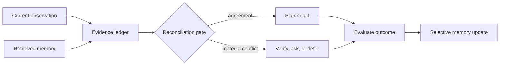

# DSER Agent Framework

**Dual-Stream Evidence Reconciliation (DSER)** is a lightweight Python framework for agents that must combine **current observations** with **retrieved memory** without treating either as unquestioned truth.

DSER preserves source metadata, detects disagreements, evaluates freshness and provenance, and selects one of five deliberate dispositions:

| Disposition | Meaning |
| --- | --- |
| `ACT` | Evidence agrees and meets the configured safety threshold. |
| `PLAN` | A low-risk next-step plan is appropriate, but evidence still has controlled ambiguity. |
| `VERIFY` | Material claims conflict and a trusted source must resolve the conflict. |
| `ASK` | The user owns the missing information or no trusted source is available. |
| `DEFER` | The agent lacks sufficient evidence or permission to act safely. |

> **DSER is an engineering framework, not a model of consciousness or a medical theory.** It does not make neurological, clinical, or diagnostic claims.

## Why DSER?

A conventional memory-augmented agent often appends retrieved text to the current prompt and lets the model decide what to trust. DSER makes that decision process explicit and auditable. It treats retrieval as a source of hypotheses and context; fresh, authoritative observations remain independently represented.



## Features

| Capability | Included in v0.1 |
| --- | --- |
| Typed claims with source, authority, confidence, relevance, timestamps, and provenance | Yes |
| Parallel current-observation and memory retrieval | Yes |
| Deterministic conflict detection | Yes |
| Freshness- and provenance-aware decision policy | Yes |
| Pluggable verification interface | Yes |
| Selective outcome-linked episodic memory | Yes |
| Typed action callback and full decision trace | Yes |
| External LLM or vector database dependency | No — bring your own adapter |

## Quick start

The framework has no runtime dependencies beyond Python 3.11+.

```bash
git clone https://github.com/EdgeAgent/dser-agent-framework.git
cd dser-agent-framework
python3 -m pip install -e .
python3 -m dser
```

The demonstration intentionally creates a conflict: an old memory says the account plan is `annual`, while the current system of record says `monthly`. Because the task is medium risk, DSER invokes a verifier before selecting the current `monthly` value.

## Minimal integration

```python
from dser import (
    AgentTask,
    Claim,
    DSERAgent,
    InMemoryStore,
    ReconciliationPolicy,
    RiskLevel,
    SourceKind,
)

agent = DSERAgent(
    memory=InMemoryStore(),
    policy=ReconciliationPolicy(),
)

observation = Claim(
    key="order.status",
    value="shipped",
    source=SourceKind.SYSTEM_OF_RECORD,
    authority=0.95,
    confidence=0.99,
    relevance=1.0,
    provenance="orders-api:v1",
    support=("order:123",),
)

result = agent.decide(
    AgentTask(
        key="order.status",
        goal="Tell the customer the latest order status.",
        risk=RiskLevel.LOW,
    ),
    observations=(observation,),
)

print(result.decision.disposition.value)  # act
```

## Evidence model

Every `Claim` is a normalized proposition with a `key`, `value`, source kind, authority, confidence, relevance, timestamps, and provenance. DSER ranks claims using configurable weights, but hard constraints remain explicit:

1. A claim with no provenance cannot silently become authoritative because its confidence is high.
2. A material conflict triggers verification for medium-, high-, and critical-risk tasks.
3. A fresh authoritative source can supersede stale memory, but the disagreement remains visible in the audit trace.
4. Permanent memory only accepts records that are validated, useful, and source-attributed.

See [docs/design.md](docs/design.md) for the complete architecture contract and [examples/resolve_conflict.py](examples/resolve_conflict.py) for a runnable integration example.

## Adapters

DSER is intentionally provider-independent. Add integrations by adapting your own services to the small interfaces below.

| Extension point | Contract |
| --- | --- |
| Observation provider | `Callable[[AgentTask], Iterable[Claim]]` |
| Memory store | `retrieve(key) -> tuple[Claim, ...]` and `write(record) -> bool` |
| Verification tool | `verify(task) -> Claim | None` |
| Action executor | `Callable[[AgentTask, Claim], ActionResult]` |

This separation makes it straightforward to connect an LLM, a retrieval system, a CRM, a database, or a tool-calling runtime without allowing any one integration to bypass the reconciliation gate.

## Validation

```bash
python3 -m unittest discover -s tests -v
python3 -m dser
python3 examples/resolve_conflict.py
```

## Design foundations

DSER is inspired by practical agent research on interleaving reasoning and action, managed memory, reflective feedback, planning, and interactive evaluation. It does **not** claim to reproduce the underlying neuroscience discussed in the accompanying design paper.

- Shunyu Yao et al., [*ReAct: Synergizing Reasoning and Acting in Language Models*](https://arxiv.org/abs/2210.03629).
- Noah Shinn et al., [*Reflexion: Language Agents with Verbal Reinforcement Learning*](https://arxiv.org/abs/2303.11366).
- Charles Packer et al., [*MemGPT: Towards LLMs as Operating Systems*](https://arxiv.org/abs/2310.08560).
- Andy Zhou et al., [*Language Agent Tree Search Unifies Reasoning, Acting, and Planning in Language Models*](https://arxiv.org/abs/2310.04406).
- Xiao Liu et al., [*AgentBench: Evaluating LLMs as Agents*](https://arxiv.org/abs/2308.03688).

## Roadmap

The first release focuses on a small, testable reference implementation. Planned work includes durable memory adapters, provenance schemas, richer conflict types, pluggable planning policies, structured audit export, and benchmark harnesses.

## License

Distributed under the [MIT License](LICENSE). The license name does not imply affiliation with the Massachusetts Institute of Technology.
