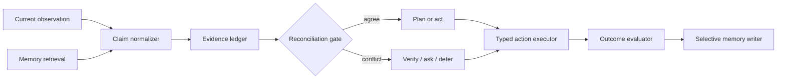

# DSER Architecture

## Purpose

Dual-Stream Evidence Reconciliation (DSER) is a lightweight, provider-independent Python framework for agents that must combine **current observations** with **retrieved memory** without allowing either to become an unexamined source of truth.

DSER treats both streams as evidence. It normalizes them into claims, preserves provenance, evaluates material conflict and freshness, and routes the result to one of five dispositions: `ACT`, `PLAN`, `VERIFY`, `ASK`, or `DEFER`.

## Core principles

| Principle | Implementation rule |
| --- | --- |
| Separate channels | Observations and memory are normalized separately before reconciliation. |
| Evidence before confidence | A high confidence score never compensates for missing provenance on consequential claims. |
| Current authority matters | A fresh, authoritative observation can supersede stale memory. |
| Conflict is actionable | Disagreement triggers verification, clarification, planning, or deferral—not rationalization. |
| Memory is selective | Only validated, useful outcomes are retained as durable episodes. |
| Safety is explicit | Permissions and risk thresholds are inputs to the decision policy. |

## Components

| Component | Responsibility |
| --- | --- |
| `Observation` | Represents fresh user, environment, or tool evidence. |
| `MemoryStore` | Retrieves durable prior context and selectively writes validated outcomes. |
| `EvidenceLedger` | Preserves claims, source metadata, timestamps, authority, and support. |
| `ReconciliationPolicy` | Scores support, relevance, freshness, provenance, agreement, and risk. |
| `VerificationTool` | Resolves material conflicts against an authoritative source. |
| `DSERAgent` | Orchestrates concurrent retrieval, reconciliation, verification, and memory updates. |

## Non-goals

DSER does not claim to model human consciousness, hemispheric specialization, neurological diagnosis, déjà vu, or a universal neural timing law. It is an engineering framework for evidence-aware agent control.
